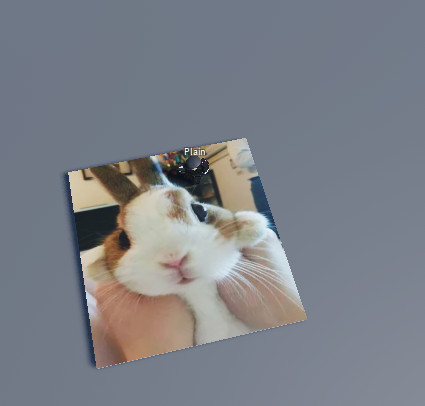

# Remote Image Library
Remote Image Library is a Luau library designed to generate EditableImage instances from PNG files. PNG files are provided to the script through a HTTP GET request.
Remote Image Library makes it possible to off-site images  


The EditableImage instance can be parented to a MeshPart, ImageLabel, ImageButton and Decal to replace its image. For more details on the EditableImage class, visit https://create.roblox.com/docs/reference/engine/classes/EditableImage.

### Table of Contents:
- [1. Features](#1-features) 
- [2. Usage](#2-usage)
    - [2.1. Server Usage](#21-server-usage)
    - [2.2. Server Usage](#22-client-usage)
- [3. Attributions](#3-attributions)
- [4. Installation](#4-installation)
    - [4.1. Embedding Into a Rojo Project](#41-embedding-into-a-rojo-project)
    - [4.2. Building from Source](#42-building-from-source)
- [5. API Reference](#5-api-reference)

## 1. Features
Remote Image Library features:
- Loading PNGs from;
    - Urls,
    - Binary Strings
    - Pixel Arrays,
- HTTP request queuing to prevent violating the rate limits.
- An optional custom `http_get_async` override to integrate with your own queue / proxy.
- Usage on both client & server with authentication.

## 2. Usage

> [!WARNING]
> This library was created as a demonstration, it is the responsibility of the user to ensure its use doesn't violate Roblox's TOS.

### 2.1. Server Usage
The simplest use of Remote Image Library is on the server. Please not that as of 2 December 2023, EditableImages do not replicate between the server->client boundry.
```lua
local remote_img = require(path.to.library);
local spawn_location = workspace:WaitForChild("SpawnLocation");
local editable_image = remote_img.create_image("https://i.imgur.com/eX24dFX.png");

editable_image.Parent = spawn_location:WaitForChild("Decal");
```

### 2.2. Client Usage
```lua
-- SERVER:
local remote_img = require(path.to.library);
remote_img.serve(function(player : Player, url : string)
    local is_https = remote_img.builtin.protocols(url, {"https"});

    local is_imgur = remote_img.builtin.hosts(url, { -- Limit to imgur
        "i.imgur.com"
    });

    local is_player_allowed = remote_img.builtin.user_ids(player, { -- Limit players.
        56098303
    });

    return is_https             -- Request must be using HTTPS
        and is_imgur            -- and must be to i.imgur.com
        and is_player_allowed;  -- and made by @plainenglish
end);

-- CLIENT:
local remote_img = require(path.to.library);
local spawn_location = workspace:WaitForChild("SpawnLocation");
local editable_image = remote_img.create_image("https://i.imgur.com/eX24dFX.png");
editable_image.Parent = spawn_location:WaitForChild("Decal");
```

### 2.3. Result


## 3. Attributions
This library relies upon MaximumADHD's [Roblox-PNG-Library](https://github.com/MaximumADHD/Roblox-PNG-Library/tree/master) to get pixel data from PNG files.

## 4. Installation
You can install Roblox Image Library by downloading the prebuilt model file from the GitHub release page. You may also install it with the following methods:

### 4.1. Embedding Into a Rojo Project
To embed Remote Image Library into your project, download the `./src` directory and copy it into your project.

### 4.2. Building from Source
To build the library from source, ensure you have rojo installed and run the following commands:
```bash
# Check rojo is installed
rojo --version    #> Rojo 7.4.0-rc3

# Clone the git repo
git clone https://github.com/MaximumADHD/Roblox-PNG-Library.git

# Move into the downloaded repo
cd Remote-Image-Library

# Build the library, it will be available at ./remote_image.rbxmx
rojo build -o "remote_img.rbxmx"
```

## 5. API Reference

1. [create_image](#create_image)
2. [serve](#serve)
3. [create_image_from_array](#create_image_from_array)
4. [create_image_from_string](#create_image_from_string)
5. [builtin.protocols](#builtinprotocols)
6. [builtin.hosts](#builtinhosts)
7. [builtin.paths](#builtinpaths)
8. [builtin.user_ids](#builtinuser_ids)
9. [builtin.allow_all](#builtinallow_all)
10. [http_get_async](#http_get_async)

### create_image
> The `create_image` function generates an EditableImage instance from the passed URL string.
> 
> #### Function Signature:
> ```lua
> create_image(url : string) : EditableImage
> ```
>
> #### Parameters:
> 1. `url : string` - The URL to request image data from.
> 
> #### Returns:
> 1. `EditableImage` - The generated Editable Image Instance.
> 
> #### Example Usage:
> ```lua
> local editable_image = remote_img.create_image("https://i.imgur.com/eX24dFX.png");
> editable_image.Parent = game.Workspace.SpawnLocation.Decal;
> ```

### serve
> The `serve` function allows clients to use `create_image` with an optional authentication function.
>
> #### Function Signature:
> ```lua
> serve(auth : (Player, string) -> (boolean)?) : nil
> ```
> 
> #### Parameters:
> 1. `url : string` - The URL to request image data from.
> 
> #### Returns:
> 1. `EditableImage` - The generated Editable Image Instance.
> 
> #### Example Usage:
> ```lua
> remote_img.serve(remote_img.builtin.allow_all);
> ```

### create_image_from_array
> The `create_image_from_array` function creates an EditableImage from a pixel array.
>
> #### Function Signature:
> ```lua
> create_image_from_array(pixel_array : string, width : number, height : number) : EditableImage
> ```
> 
> #### Parameters:
> 1. `pixel_array : {number}` - The flat pixel array (`{r, g, b, a,    r, g, b, a...}`)
> 2. `width : number` - The width of the image.
> 3. `height : number` - The height of the image.
> 
> #### Returns:
> 1. `EditableImage` - The generated Editable Image Instance.
> 
> #### Example Usage:
> ```lua
> local red_pixels = {1, 0, 0, 0,    1, 0, 0, 0,
>                     1, 0, 0, 0,    1, 0, 0, 0};
>
> local editable_image = remote_img.create_image_from_array(red_pixels, 2, 2);
> editable_image.Parent = game.Workspace.SpawnLocation.Decal;
> ```

### create_image_from_string
> The `create_image_from_string` function generates an EditableImage instance from the passed binary string (or buffer).
> 
> #### Function Signature:
> ```lua
> create_image_from_string(data : string | buffer) : EditableImage
> ```
>
> #### Parameters:
> 1. `data : string | buffer` - The binary string containing the image data.
> 
> #### Returns:
> 1. `EditableImage` - The generated Editable Image Instance.
> 
> #### Example Usage:
> ```lua
> local editable_image = remote_img.create_image_from_string("\x89\x50\x4E\x47...");
> editable_image.Parent = game.Workspace.SpawnLocation.Decal;
> ```

### builtin.protocols
> The `builtin.protocols` function returns true if the passed url's protocol is within the passed array.
> 
> #### Function Signature:
> ```lua
> builtin.protocols(url : string, protocols : {string}) : boolean
> ```
>
> #### Parameters:
> 1. `url : string` - The image url.
> 2. `protocols : {string}` - The allowed protocols.
> 
> #### Returns:
> 1. `boolean` - Whether url's protocol is contained within protocols.
> 
> #### Example Usage:
> ```lua
> local is_https = remote_img.builtin.protocols("https://i.imgur.com/eX24dFX.png", {"https"});
> ```

### builtin.hosts
> The `builtin.hosts` function returns true if the passed url's host is within the passed array.
> 
> Note: This function checks the urls entire host, including subdomain.
> 
> #### Function Signature:
> ```lua
> builtin.hosts(url : string, hosts : {string}) : boolean
> ```
>
> #### Parameters:
> 1. `url : string` - The image url.
> 2. `hosts : {string}` - The allowed hosts.
> 
> #### Returns:
> 1. `boolean` - Whether url's protocol is contained within hosts.
> 
> #### Example Usage:
> ```lua
> local is_imgur = remote_img.builtin.hosts("https://i.imgur.com/eX24dFX.png", {"i.imgur.com"});
> ```

### builtin.paths
> The `builtin.paths` function returns true if the passed url's path is within the passed array.
> 
> #### Function Signature:
> ```lua
> builtin.paths(url : string, paths : {string}) : boolean
> ```
>
> #### Parameters:
> 1. `url : string` - The image url.
> 2. `paths : {string}` - The allowed paths.
> 
> #### Returns:
> 1. `boolean` - Whether url's protocol is contained within hosts.
> 
> #### Example Usage:
> ```lua
> local is_bunny = remote_img.builtin.hosts("https://i.imgur.com/eX24dFX.png", {"eX24dFX.png"});
> ```

### builtin.user_ids
> The `builtin.user_ids` function returns true if the Player's UserId is within the passed array.
> 
> #### Function Signature:
> ```lua
> builtin.user_ids(player : Player, user_ids : {number}) : boolean
> ```
>
> #### Parameters:
> 1. `player : Player` - The player.
> 2. `user_ids : {number}` - The allowed user ids.
> 
> #### Returns:
> 1. `boolean` - Whether player's user id is found.
> 
> #### Example Usage:
> ```lua
> local is_plain = remote_img.builtin.user_ids(game.Players.LocalPlayer, {56098303});
> ```

### builtin.allow_all
> The `builtin.allow_all` function always returns true.
> 
> #### Function Signature:
> ```lua
> builtin.allow_all() : boolean
> ```
> 
> #### Returns:
> 1. `boolean` - True
> 
> #### Example Usage:
> ```lua
> local _true = remote_img.builtin.allow_all();
> ```

### http_get_async
> The `http_get_async` function queues a HTTP get request with the internal http queue and returns the result. Throws an error if unsuccessful.
> 
> #### Function Signature:
> ```lua
> http_get_async(url : string) : string
> ```
>
> #### Parameters:
> 1. `url : string` - The target url
> 
> #### Returns:
> 1. `string` - The response body.
> 
> #### Example Usage:
> ```lua
> local google_homepage = remote_img.http_get_async("https://google.com/");
> ```